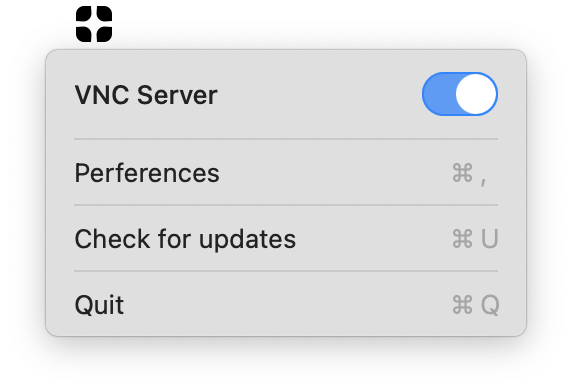
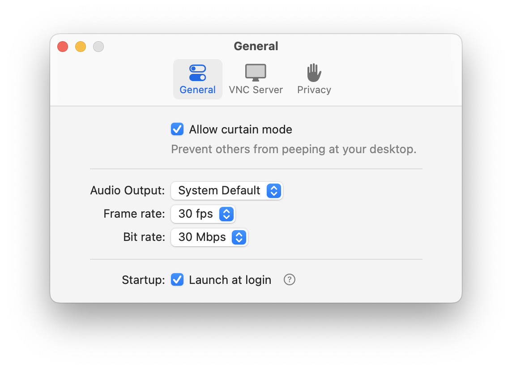
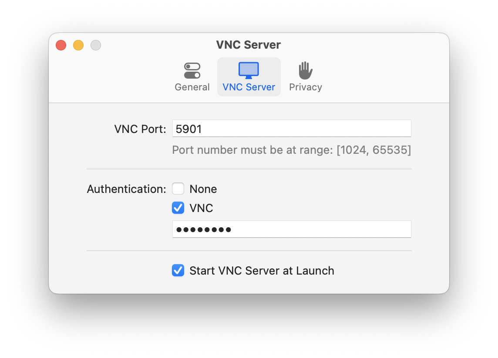
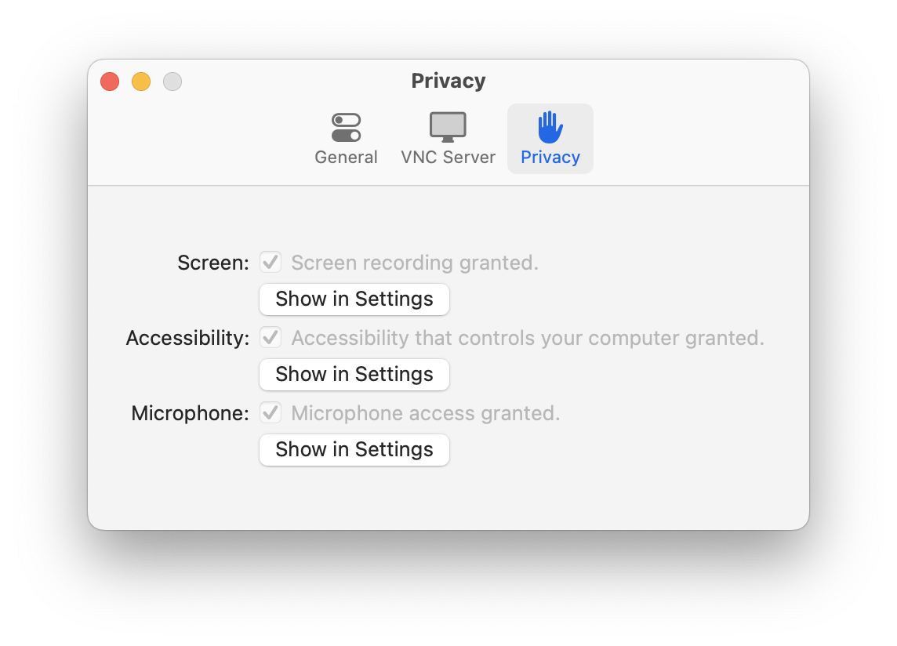

# Xanyd
An alternative VNC server on macOS[^1].  
Enhanced performance for both Apple Silicon and Intel Processors. 

## Features
- Secure connection (TLS v1.3)
- Support multi-screen
- Support Curtain mode [^2]
- Support H.264 video streaming
- Support LPCM audio playback[^3]

## Installation
### Download frame the Release Page
1. Down from the [Realease Page](https://github.com/XanyApp/Xanyd/releases)
2. Open the dmg file
3. Drag the App to the /Applications folder

### brew
```
brew tap XanyApp/xanyd https://github.com/XanyApp/xanyd
brew install --cask xanyd
```

## Screen shots





[^1]: Xanyd is **not compatible** with the other VNC clients, only support **Xany VNC** [^2] client.
[^2]: See more details for [Xany VNC](https://xany.app/xany_vnc.html).
[^3]: Only works when the [BlackHole](https://github.com/ExistentialAudio/BlackHole) is installed.
